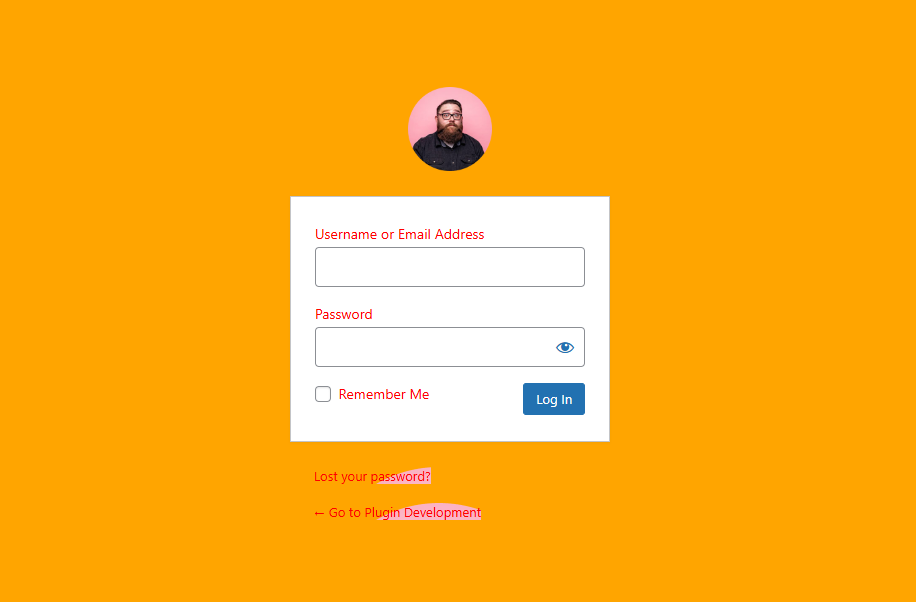

# WP Login Customizer




## Description
WP Login Customizer is a powerful and easy-to-use WordPress plugin designed to help you fully customize the default WordPress login page. Whether you're creating a professional, branded experience or simply want to personalize your site, this plugin provides all the tools you need to make your login page truly unique.
Key Features:
Custom Logo: Replace the default WordPress logo with your own custom logo for a more branded look.
Custom Text: Personalize the text on the login page, including the "Lost your password?" link and footer text.
Custom Text Color: Change the text color to match your site's branding or personal preference.
Custom Background Color: Adjust the background color of the login page to enhance the design and match your brand identity.

## Table of Contents
If your README is long, include a table of contents:
- [Installation](#installation)
- [Usage](#usage)
- [Features](#features)
- [Contributing](#contributing)
- [License](#license)

## Installation
Step-by-step instructions on how to install and set up your project. For example:

```bash
git clone https://github.com/vivek-msn/wp-login-customizer.git
cd wp-login-customizer
npm install
